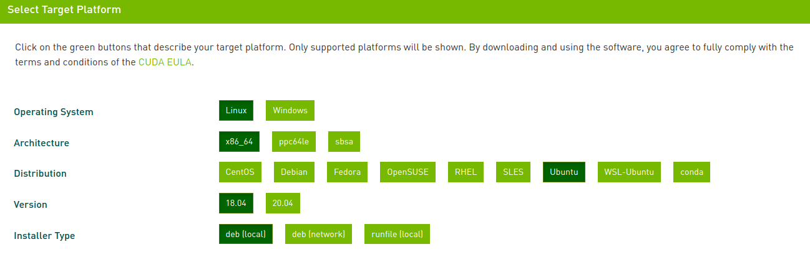
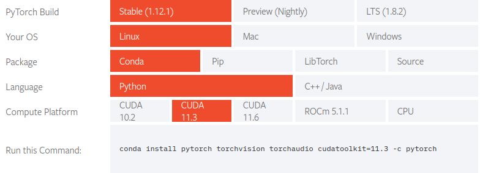

# Ubuntu 18.04 LTS 安裝Cuda CuDNN Pytorch 

1. [Install Nvidia Driver](#1)
2. [Install CUDA](#2)
3. [Install cuDNN](#3)
4. [Install pytorch](#4)

<h2 id="1"> Install Nvidia Driver </h2>
更新軟體庫及確認可安裝的版本  

> sudo apt update  
ubuntu-drivers devices


提示建議安裝nvidia-driver-470
> sudo apt install nvidia-driver-xxx

安裝完畢後重啟電腦，查看Nvidie Driver訊息
> nvidia-smi


Cuda版本支援到 11.4

<h2 id="2"> Install CUDA </h2>  
https://developer.nvidia.com/cuda-toolkit-archive

選擇要安裝的平台

  

依所提示的指令安裝 CUDA


顯示卡驅動已經安裝過，故不再安裝


CUDA安裝完畢後，開敵.bashrc
> sudo gedit ~/.bashrc

添加路徑
```
export LD_LIBRARY_PATH=$LD_LIBRARY_PATH:/usr/local/cuda-xx.x/lib64
export PATH=$PATH:/usr/local/cuda-xx.x/bin
```

確認CUDA，開啟新的terminal，輸入
> nvcc -V

安裝成功出現如下


<h2 id="3"> Install cuDNN </h2> 

安裝 Zlib
> sudo apt-get install zlib1g

下載 cuDNN  
https://developer.nvidia.com/rdp/cudnn-download  
需註冊登入，下載 Local Installer for Linux x86_64 (Tar) 


在儲存cuDNN tar 檔案處，開啟終端
解壓縮：
> tar -xvf cudnn-linux-x86_64-8.x.x.x_cudaX.Y-archive.tar.xz  

將檔案複製至本地cuda
```
sudo cp cudnn-*-archive/include/cudnn*.h /usr/local/cuda-X.Y/include     
sudo cp -P cudnn-*-archive/lib/libcudnn* /usr/local/cuda-X.Y/lib64  
sudo chmod a+r /usr/local/cuda-X.Y/include/cudnn*.h /usr/local/cuda-X.Y/lib64/libcudnn*
```


<b>Note:</b>以前的版本可以用以下指令查看 (25th Aug 2022)
> cat /usr/local/cuda/include/cudnn.h | grep CUDNN_MAJOR -A 2  

目前的版本中無此資訊

<h2 id="4"> Install Nvidia Driver </h2>

https://pytorch.org/get-started/locally/  

選擇要安裝的檔案，依照提非安裝



驗證 PyTorch，在終端輸入以下指令
```
import torch 

x = torch.rand(2, 3) 

print(x)
```
會產生隨機的 2x3 張量如下：


測試pytorch GPU
```
device = torch.device("cuda:0" if (torch.cuda.is_available()) else "cpu")
print(torch.cuda.get_device_name(device))
```


