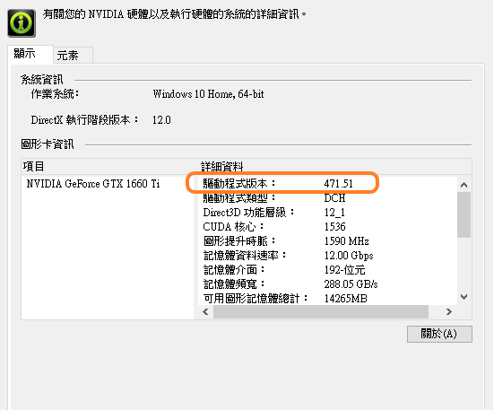
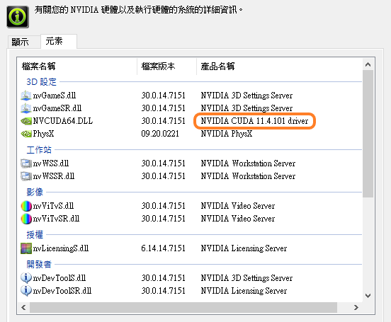
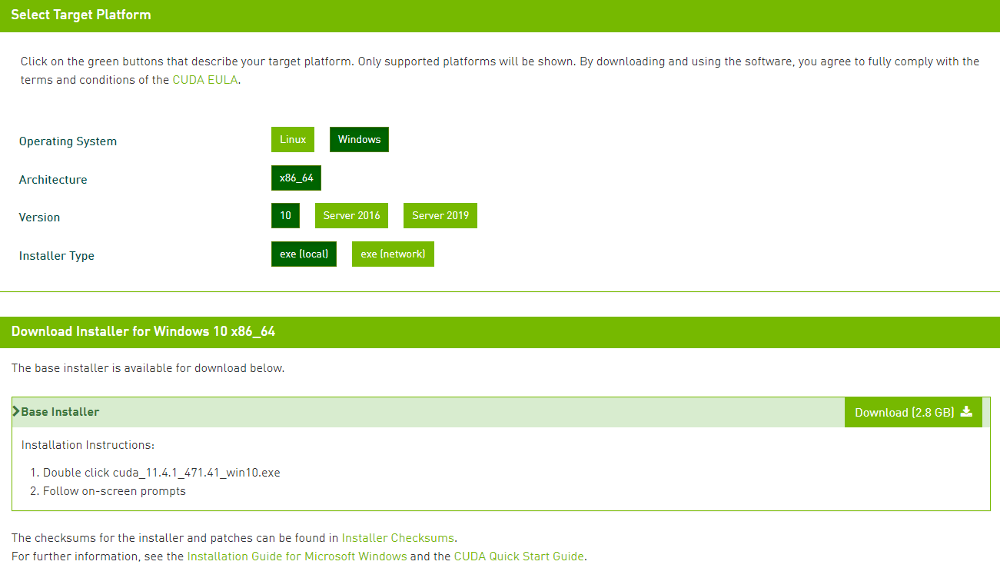
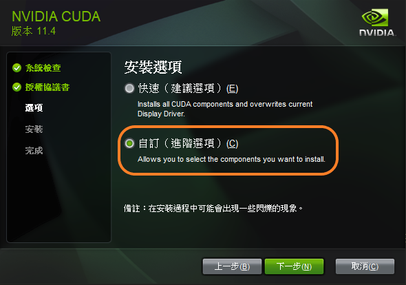
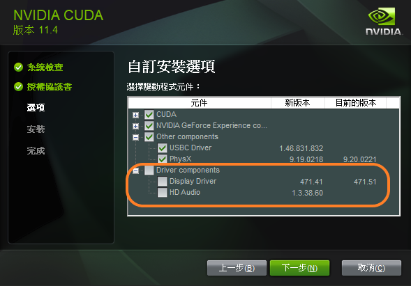
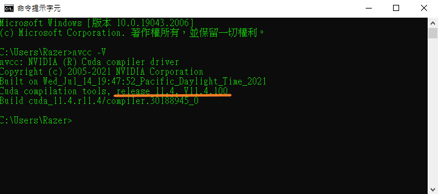
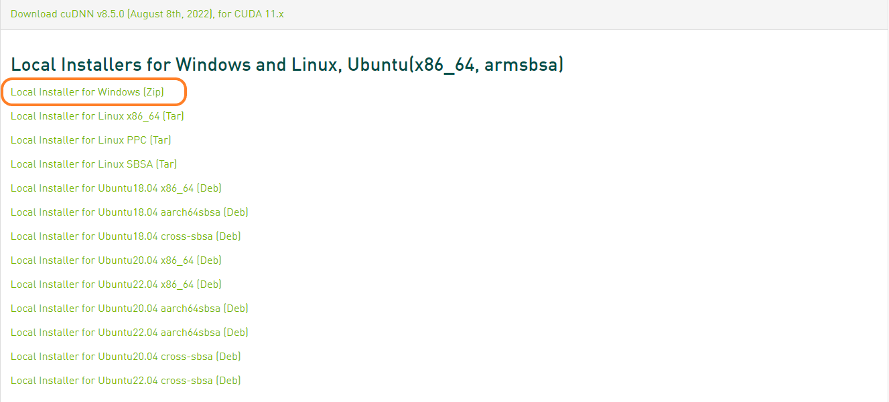
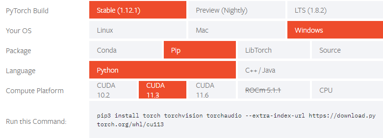
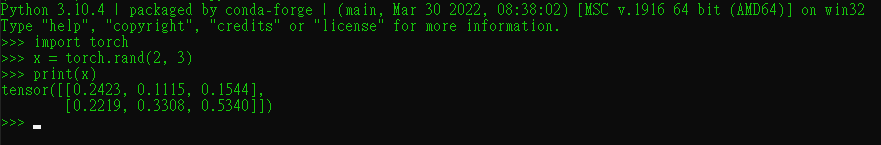
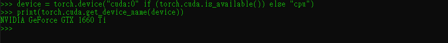

# Win10 安裝Cuda CuDNN Pytorch

[Ubuntu 18.04 LTS 安裝 Cuda CuDNN Pytorch](./README.md)

1. [Nvidia Driver](#1)
2. [Install CUDA](#2)
3. [Install cuDNN](#3)
4. [Install pytorch](#4)

<h2 id="1"> Nvidia Driver </h2>  

工具列開啟Nvidia設定，確認可安裝的Cuda版本  


點選左下角系統資訊，出現GPU Driver版本



CUDA支援版本 -> 我的電腦Cuda支援到11.4.101  



如果要安裝的Cuda版本大於可支援的版本，那就需更新GPU Driver，也可以在安裝CUDA時一起更新
[Nvidia](https://www.nvidia.com/Download/index.aspx)


<h2 id="2"> Install CUDA </h2>  

[Official Installation Guide](https://docs.nvidia.com/cuda/cuda-installation-guide-microsoft-windows/index.html)

https://developer.nvidia.com/cuda-toolkit-archive  
選擇要安裝的平台，這裡選擇CUDA Toolkit 11.4.1

選擇平台及安裝方式


開始安裝，若不需要更新GPU Driver，選自訂安裝





確認CUDA安裝，開啟命令提示字元，輸入
>nvcc -V  

出現Cuda版本資訊



<h2 id="3"> Install cuDNN </h2>

[Official Installation Guide](https://docs.nvidia.com/deeplearning/cudnn/install-guide/index.html)

<b>下載 Zlib</b>  [64-Bit Download](http://www.winimage.com/zLibDll/zlib123dllx64.zip)  
解壓複製到 C:\Windows\System32

下載 cuDNN  
https://developer.nvidia.com/rdp/cudnn-download  
需註冊登入，下載 Local Installer for Windows (Zip) 



解壓縮後將對應的資料夾合併至Nvidia cuDNN資料夾  

a. Copy bin\cudnn*.dll to C:\Program Files\NVIDIA GPU Computing Toolkit\CUDA\vXX.Y\bin.  

b. Copy include\cudnn*.h to C:\Program Files\NVIDIA GPU Computing Toolkit\CUDA\vXX.Y\include.  

c. Copy lib\cudnn*.lib to C:\Program Files\NVIDIA GPU Computing Toolkit\CUDA\vXX.Y\lib.


<h2 id="4"> Install pytorch </h2>

https://pytorch.org/get-started/locally/  

選擇要安裝的版本及平台，依指令安裝

  

驗證 PyTorch，在終端輸入以下指令

```
import torch 

x = torch.rand(2, 3) 

print(x)
```
會產生隨機的 2x3 張量如下：



測試pytorch GPU
```
device = torch.device("cuda:0" if (torch.cuda.is_available()) else "cpu")
print(torch.cuda.get_device_name(device))
```


